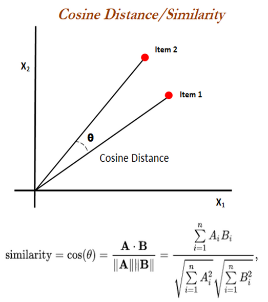

# Document Similarity with BERT

This is a classical exercise that can be a take home assignment for a NLP Data Scientist position.


The requirement is to write a program in the language of choice that calculates the top 5 similar documents for each document, in a corpus of 1,000 documents.
```
Write a program in the language of your choice that calculates the top 5 similar documents for each document, based on your preferred content similarity method for the given corpus. Results must be sorted by their similarity score in descending order.


Input is:

{DocID} TAB {DocText} NEWLINE


Output should be:

{DocID} TAB {DocID1}:{Score1} TAB {DocID2}:{Score2} TAB {DocID3}:{Score3}, … NEWLINE
```


I have decided to use BERT and cosine similarity. For the full project description please review the `00_document_similarity_problem.ipynb` Jupyter Notebook.

Below is the graphical representation of the **cosine similarity** of 2 documents encoded as vectors.



# 👨‍💻 Usage

To encode the documents and retrive the output, as per instructions, please run the code below.

```python

python -u main.py

```

The *output.tsv* file will be saved in the folder ***data***.
